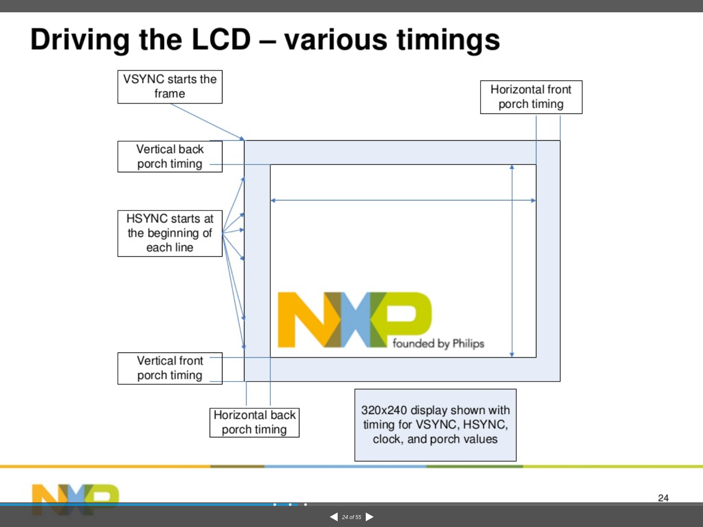

# 显示器相关的timing含义

参考文章: http://www.cnblogs.com/biglucky/p/4142505.html


> 数据使能（DE）： 在数据使能区是有效的色彩数据，不在使能范围内的都显示黑色。

>    前肩（Front Porch）/后肩 （Back Porch） ：行同步或场同步信号发出后，视频数据不能立即使能，要留出电子枪回扫的时间。以行扫描为例，从HSYNC结束到DE开始的区间成为行扫描的后肩（绿色区域），从DE结束到HSYNC开始称为前肩（紫色区域）。同样对于场扫面也可以由类似的定义。

```
HFP: Horizon front porch
HBP: Horizon back porch
VFP: Vertical front porch
VBP: Vertical back porch
HDP： Horizon display period
VDP:  Vertical display period

HTP = HSYNC + HDP + HFP + HBP
VTR = VSYNC + VDP + VFP + VBP

f dot _ clk = pixel clock
f dot _ clk = f v * VTR * HTP
```



>from kernel/Documentation/fb/framebuffer.txt
```
+----------+---------------------------------------------+----------+-------+
|          |                ↑                            |          |       |
|          |                |upper_margin                |          |       |
|          |                ↓                            |          |       |
+----------###############################################----------+-------+
|          #                ↑                            #          |       |
|          #                |                            #          |       |
|          #                |                            #          |       |
|          #                |                            #          |       |
|   left   #                |                            #  right   | hsync |
|  margin  #                |       xres                 #  margin  |  len  |
|<-------->#<---------------+--------------------------->#<-------->|<----->|
|          #                |                            #          |       |
|          #                |                            #          |       |
|          #                |                            #          |       |
|          #                |yres                        #          |       |
|          #                |                            #          |       |
|          #                |                            #          |       |
|          #                |                            #          |       |
|          #                |                            #          |       |
|          #                |                            #          |       |
|          #                |                            #          |       |
|          #                |                            #          |       |
|          #                |                            #          |       |
|          #                ↓                            #          |       |
+----------###############################################----------+-------+
|          |                ↑                            |          |       |
|          |                |lower_margin                |          |       |
|          |                ↓                            |          |       |
+----------+---------------------------------------------+----------+-------+
|          |                ↑                            |          |       |
|          |                |vsync_len                   |          |       |
|          |                ↓                            |          |       |
+----------+---------------------------------------------+----------+-------+
```