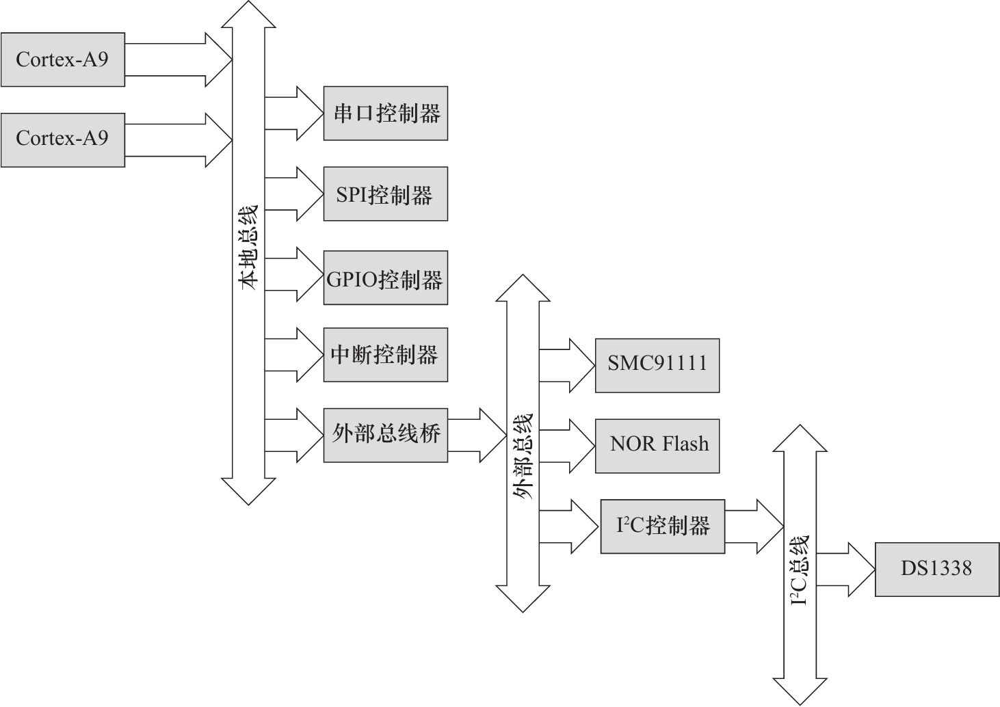

# Device Tree 笔记

来源: [Linux设备驱动开发详解：基于最新的Linux4.0内核](http://www.duokan.com/book/96068) 第十八章

device tree中的公共部分保存为`.dtsi`, 需要的时候通过`/include/ "xxxxx.dtsi"` 来加载到自己的dts文件中

**举个栗子:**

```c
/{
        node1 {
                a-string-property = "A string";
                a-string-list-property = "first string", "second string";
                a-byte-data-property = [0x01 0x23 0x34 0x56];
                child-node1 {
                        first-child-property;
                        second-child-property = <1>;
                        a-string-property = "Hello, world";
                };
                child-node2 {
                };
        };
        node2 {
                an-empty-property;
                a-cell-property = <1 2 3 4>; /* each number (cell) is a uint32 */
                child-node1 {
                };
        };
};
```

root节点用`/`来表示, 后面接上一些列子节点, 比如上面的node1和node2, 每个子节点下面还可以有自己的子节点, 比如上面的child-node1 和child-node2.

每一个节点都可以有一系列的属性, 可以为空, 可以为字符串, 也可以是字符串 list, Cells, 二进制数等.




## 相关工具

如何反编译 ```./scripts/dtc/dtc -I dtb -O dts -o xxx.dts arch/arm/boot/dts/xxx.dtb,```


linux内核通过根节点 / 的 compatible来确定启动的是什么设备, 通常这个字段由 `：<manufacturer>，<model>` 组成

例如 `compatible = "arm,vexpress,v2p-ca15_a7", "arm,vexpress";`


普通设备, 通过设置`of 匹配表`来和deivce tree匹配, 例如

```c
static const struct of_device_id a1234_i2c_of_match[] = {
      { .compatible = "acme,a1234-i2c-bus", },
      {},
}
MODULE_DEVICE_TABLE(of, a1234_i2c_of_match);
static struct platform_driver i2c_a1234_driver = {
    .driver = {
        .name = "a1234-i2c-bus",
        .owner = THIS_MODULE,
        .of_match_table = a1234_i2c_of_match,
    },
    .probe = i2c_a1234_probe,
    .remove = i2c_a1234_remove,
};
module_platform_driver(i2c_a1234_driver);
```

对于I2C以及SPI设备来说, 除了可以用上述的方法外, 我们也可以使用弱匹配的方式, 也就是用`别名`来匹配, 别名实际就是<model>部分, 如果别名出现在了driver或者id_table中, 或者别名与driver的name字段相同, 就会匹配上

如果一个驱动需要兼容多个设备, 则需要使用

```c
int of_device_is_compatible(const struct device_node *device,const char *compat);
```

来区分当前是绑定的哪一个设备.    此外还可以采用在驱动的of_device_id表中填充.data成员的形式


## 设备节点及label的命名

节点的命名遵循`<name>[@<unit-address>]`, name 表示设备类型(也就是说最好用表示类型的字符串, 而不是具体芯片名称), 相同类型的节点, 可以有相同的name, 只要他们的unit-address不相同即可, 例如`serial@101f0000与serial@101f2000`. unit-address地址也经常在其对应的reg属性中给出, 例如

```c
    sysram@02020000 {
    	compatible = "mmio-sram";
        reg = <0x02020000 0x20000>;
        …
    }
```

对于I2C设备, @后面一般是加上设备的I2C地址, 

我们可以为一个节点添加label, 以后可以通过这个`&label`来访问,  这是通过phandle来实现的

习惯上我们用<设备类型><index> 来对lable命名, 例如 i2c1: i2c@addr


## 　地址编码

对于可以寻址的设备, linux使用如下方式来存储编码地址

```c
reg
#address-cells
#size-cells
```

其中`reg`的组织形式为 `reg = <addr1 len1 \[ addr2 len2 \] \[ addr3 len3 \]...>, 

如果#size-cells = 0 则 len字段为空


